# 🕐 FSM-Based Multi-mode Digital Time Keeping System


-red)


A fully synthesizable, multi-mode **Digital Clock System** implemented in **Verilog HDL** and targeted at the **Basys 3 FPGA development board** (Xilinx XC7A35T — 100 MHz). The system integrates six functional modes in a single top-level design, driven by a finite state machine (FSM) and displayed on the onboard 4-digit 7-segment display.

---

## 📌 Table of Contents

- [Overview](#overview)
- [Features](#features)
- [System Architecture](#system-architecture)
- [Module Descriptions](#module-descriptions)
- [Simulation Results](#simulation-results)
- [Project Structure](#project-structure)
- [Hardware Requirements](#hardware-requirements)
- [Software Requirements](#software-requirements)
- [How to Run Simulation](#how-to-run-simulation)
- [How to Synthesize](#how-to-synthesize)
- [I/O Pin Mapping](#io-pin-mapping)
- [Future Improvements](#future-improvements)
- [Contributors](#contributors)
- [License](#license)

---

## 🧭 Overview

This project implements an **FSM-Based Multi-mode Digital Time Keeping System** on an FPGA. It supports six operating modes selectable via push buttons, with a clean FSM-based controller managing transitions between modes. All modules are independently verified through behavioral simulation in Vivado.

The design is fully **synchronous**, uses **active-low** outputs for the Basys 3 7-segment display, and includes debounced push button inputs to prevent spurious transitions.

---

## ✨ Features

- 🕐 **Clock Mode** — Real-time HH:MM:SS display
- ⏰ **Alarm Mode** — Set and trigger a time-based alarm with buzzer
- ⏱️ **Timer Mode** — Countdown timer with buzzer alert on expiry
- 🏃 **Stopwatch Mode** — Start, pause, resume, and reset
- 🌍 **Timezone Mode** — Select a country and display local time with UTC offset
- ⚙️ **Set Time Mode** — Manually set the current time
- 🔘 **Debounced Push Buttons** — Clean single-pulse detection
- 🔔 **Buzzer Controller** — Unified alarm and timer buzzer with silence control
- 💡 **LED Debug Indicators** — Mode, edit, alarm, timer, and buzzer status
- 📺 **Multiplexed 7-Segment Display** — 4-digit display at ~1kHz refresh

---

## 🏗️ System Architecture


---

## 📦 Module Descriptions

| Module | File | Description |
|--------|------|-------------|
| Top Module | `main.v` | Integrates all submodules; routes signals based on mode |
| Clock Divider | `tick_1hz.v` | Divides 100MHz system clock to generate 1Hz clock enable |
| FSM Controller | `mode_controller.v` | Controls mode transitions, field selection, edit/load signals |
| Digital Clock | `dig_clk.v` | Up-counting HH:MM:SS clock with load support |
| UTC Clock | `utcp_5_30.v` | Settable real-time clock with field-by-field increment |
| Alarm | `alarm.v` | Compares clock time to alarm time; triggers alarm_req |
| Timer | `timer.v` | Countdown timer; asserts timer_req at zero |
| Stopwatch | `stopwatch.v` | Up-counting stopwatch with start/pause/reset |
| Offset Clock | `offset_clock.v` | Applies signed UTC offset to base clock for timezone display |
| Timezone Lookup | `tzwrtcountry.v` | ROM-based country-to-UTC-offset lookup table |
| BCD to Binary | `bcdtobin.v` | Converts 3-digit BCD (hundreds/tens/ones) to 8-bit binary |
| Buzzer Controller | `buzzer_ctrl.v` | Drives buzzer on alarm_req or timer_req; silenced by stop_pulse |
| 7-Segment Driver | `seg7_controller.v` | Multiplexed 4-digit 7-segment controller with decimal point |
| Button Debouncer | `push_button_debouncer.v` | Parameterized debounce filter producing clean single pulses |

---

## 📊 Simulation Results

All modules were individually simulated in **Vivado Behavioral Simulation** and verified against expected waveforms.

| Module | Simulation | Result |
|--------|------------|--------|
| `tick_1hz` | 1Hz pulse generation | ✅ Verified |
| `dig_clk` | Count and load | ✅ Verified |
| `mode_controller` | Mode/field transitions | ✅ Verified |
| `utcp_5_30` | Time setting | ✅ Verified |
| `alarm` | Alarm trigger and silence | ✅ Verified |
| `timer` | Countdown and timer_req | ✅ Verified |
| `stopwatch` | Start/pause/reset | ✅ Verified |
| `buzzer_ctrl` | Buzzer on/off | ✅ Verified |
| `bcdtobin` | BCD conversion | ✅ Verified |
| `tzwrtcountry` | Offset lookup | ✅ Verified |
| `offset_clock` | Timezone display | ✅ Verified |
| `main` | Full integration | ✅ Verified |

### Simulation Waveforms

| tick_1hz | dig_clk |
|----------|---------|
| 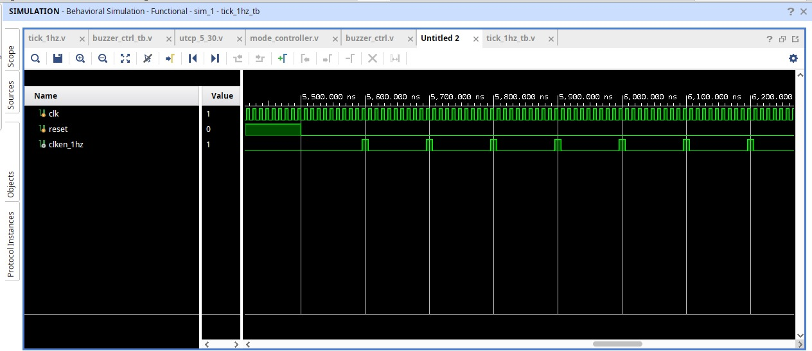 | 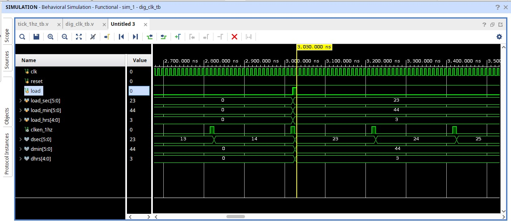 |

| FSM Controller | UTC Clock |
|----------------|-----------|
| 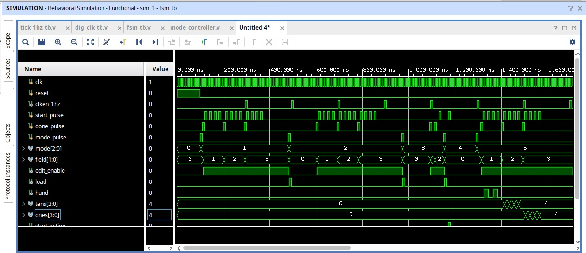 | 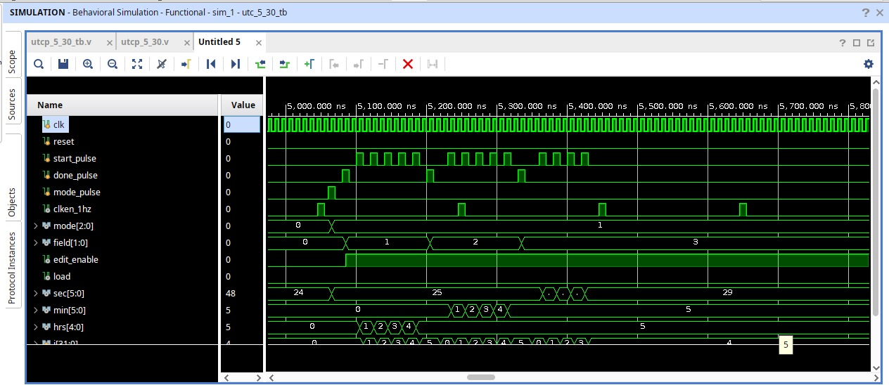 |

| Alarm | Timer |
|-------|-------|
| 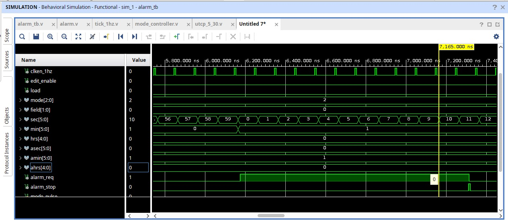 | 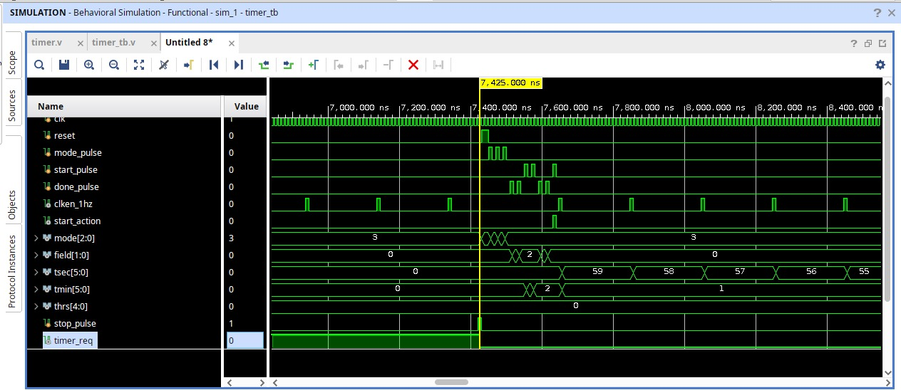 |

| Stopwatch | Buzzer |
|-----------|--------|
| 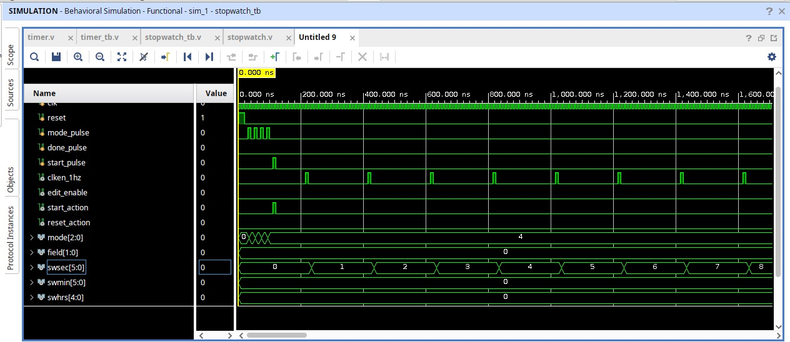 | 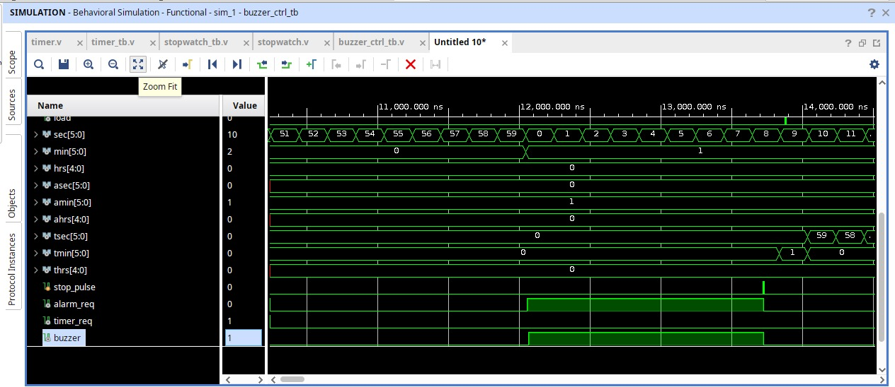 |

| BCD to Binary | Timezone Lookup |
|---------------|-----------------|
| 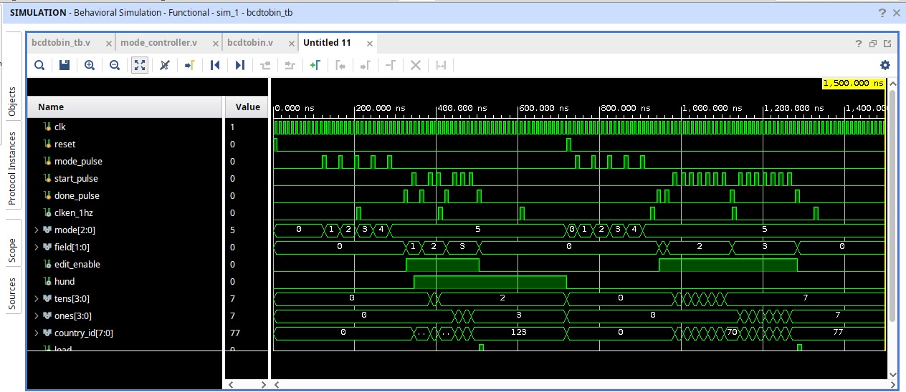 | 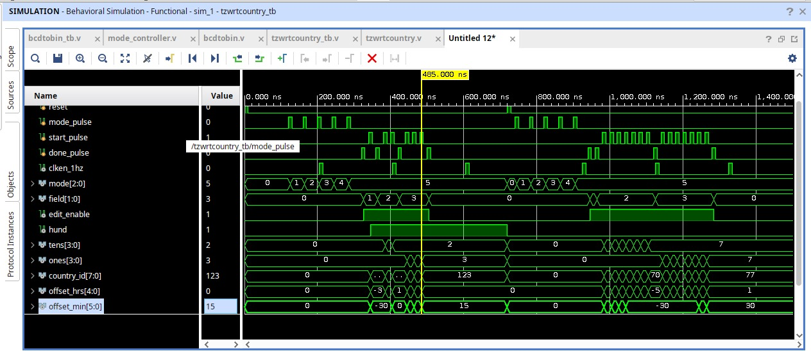 |

| Offset Clock | Top Module |
|--------------|------------|
| 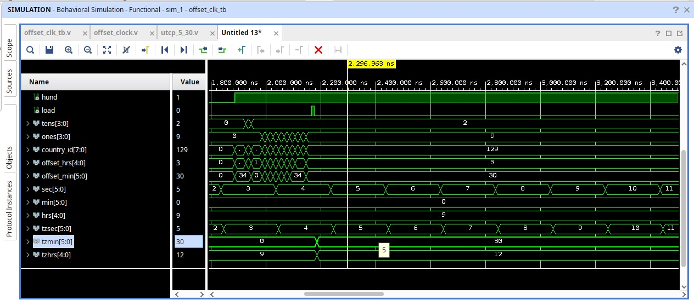 | 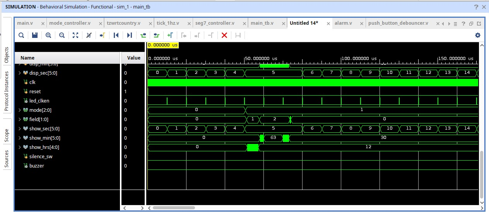 |

---

## 📁 Project Structure

```
fsm-digital-timekeeping-fpga/
│
├── src/                        # RTL source files
│   ├── main.v                  # Top-level module
│   ├── tick_1hz.v              # 1Hz clock divider
│   ├── mode_controller.v       # FSM mode controller
│   ├── dig_clk.v               # Digital clock counter
│   ├── utcp_5_30.v             # Settable UTC clock
│   ├── alarm.v                 # Alarm module
│   ├── timer.v                 # Countdown timer
│   ├── stopwatch.v             # Stopwatch
│   ├── offset_clock.v          # Timezone offset clock
│   ├── tzwrtcountry.v          # Country UTC offset lookup
│   ├── bcdtobin.v              # BCD to binary converter
│   ├── buzzer_ctrl.v           # Buzzer controller
│   ├── seg7_controller.v       # 7-segment display driver
│   └── push_button_debouncer.v # Push button debouncer
│
├── tb/                         # Testbench files
│   ├── main_tb.v
│   ├── tick_1hz_tb.v
│   ├── fsm_tb.v
│   ├── dig_clk_tb.v
│   ├── alarm_tb.v
│   ├── timer_tb.v
│   ├── stopwatch_tb.v
│   ├── buzzer_ctrl_tb.v
│   ├── bcdtobin_tb.v
│   ├── tzwrtcountry_tb.v
│   ├── offset_clk_tb.v
│   └── utcp_5_30_tb.v
│
├── sim/                        # Simulation waveform screenshots
│   ├── tick_1hz_sim.png
│   ├── dig_clk_sim.png
│   ├── fsm_sim.png
│   ├── utcp_sim.png
│   ├── alarm_sim.png
│   ├── timer_sim.png
│   ├── stopwatch_sim.png
│   ├── buzzer_sim.png
│   ├── bcdtobin_sim.png
│   ├── tzwrtcountry_sim.png
│   ├── offset_clk_sim.png
│   └── main_sim.png
│
├── constraints/                # Basys 3 XDC constraints
│   └── basys3.xdc
│
├── .gitignore                  # Vivado build artifact filter
├── README.md                   # Project documentation
└── LICENSE                     # MIT License
```

---

## 🖥️ Hardware Requirements

| Item | Specification |
|------|--------------|
| FPGA Board | Digilent Basys 3 |
| FPGA Chip | Xilinx Artix-7 XC7A35T-1CPG236C |
| System Clock | 100 MHz onboard oscillator |
| Display | 4-digit 7-segment (onboard) |
| Buttons | 5 onboard push buttons (BTNC/L/R/U/D) |
| Switches | SW0 (alarm enable) |
| LEDs | LD0–LD7 (debug indicators) |
| Buzzer | External — connected to JA PMOD pin 1 |

---

## 💾 Software Requirements

| Tool | Version |
|------|---------|
| Xilinx Vivado | 2020.1 or later |
| Vivado Simulator (XSim) | Included with Vivado |
| Operating System | Windows 10/11 or Ubuntu 20.04+ |

---

## ▶️ How to Run Simulation

1. Open **Vivado**
2. Create a new project targeting **Basys 3 (XC7A35T)**
3. Add all files from `src/` as **Design Sources**
4. Add the relevant file from `tb/` as a **Simulation Source**
5. Set the desired `_tb.v` as the **top module** for simulation
6. Click **Run Simulation → Run Behavioral Simulation**
7. Observe waveforms in the XSim window

> **Tip:** Each testbench uses a reduced `SYS_CLK_FREQ` parameter
> (e.g. 20 or 1000) so simulation completes quickly without
> waiting for a real 100MHz clock.

---

## 🔧 How to Synthesize

1. Open Vivado and load the project
2. Set `main.v` as the **top module**
3. Add `constraints/basys3.xdc` as a **constraint file**
4. Click **Run Synthesis**
5. Click **Run Implementation**
6. Click **Generate Bitstream**
7. Connect Basys 3 via USB and click **Program Device**

---

## 📍 I/O Pin Mapping

| Signal | Basys 3 Pin | Function |
|--------|------------|----------|
| `clk` | W5 | 100MHz system clock |
| `reset` | U18 (BTNC) | Global reset |
| `mode_sw` | W19 (BTNL) | Mode cycle button |
| `start_sw` | T18 (BTNU) | Start / increment button |
| `done_sw` | T17 (BTNR) | Done / confirm button |
| `silence_sw` | U17 (BTND) | Silence buzzer button |
| `alarm_en` | V17 (SW0) | Alarm enable switch |
| `seg[6:0]` | W7–W10, V7, U7, U8 | 7-segment segments |
| `an[3:0]` | U2, U4, V4, W4 | 7-segment anodes |
| `dp` | V7 | Decimal point |
| `led_mode[2:0]` | U16–E19 | Mode LEDs |
| `buzzer` | JA1 (PMOD) | External buzzer |

---

## 🔮 Future Improvements

- [ ] Add a **date display** (day/month/year)
- [ ] Implement **NTP sync** via UART for automatic time setting
- [ ] Add **PWM-based buzzer tone** for musical alarm
- [ ] Expand timezone database to all UTC offsets
- [ ] Add **OLED display** support for richer UI
- [ ] Implement **battery-backed RTC** (DS1307) via I2C
- [ ] Add **multiple alarms** support
- [ ] Port to **Nexys A7** board

---

## 👤 Contributors

| Name | Role |
|------|------|
| **Gurram Robin** | Design, RTL Coding, Simulation & Verification |

---

## 📄 License

This project is licensed under the **MIT License**.
See the [LICENSE](LICENSE) file for details.

---

> 🎓 **FSM-Based Multi-mode Digital Time Keeping System** — Developed as part of the **FPGA Design Series** at **NIELIT Tirupati**
> Simulated and verified using **Xilinx Vivado XSim**
> Target board: **Digilent Basys 3**
